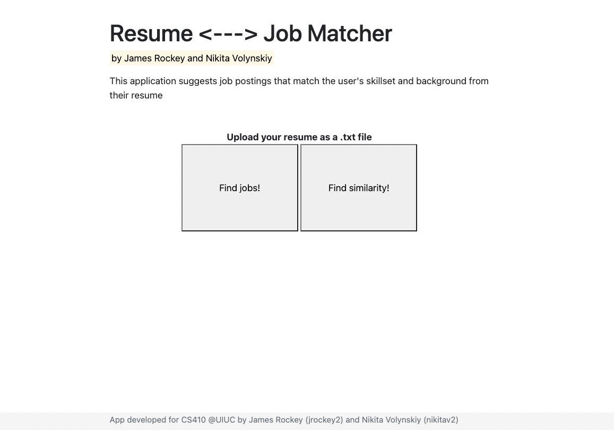
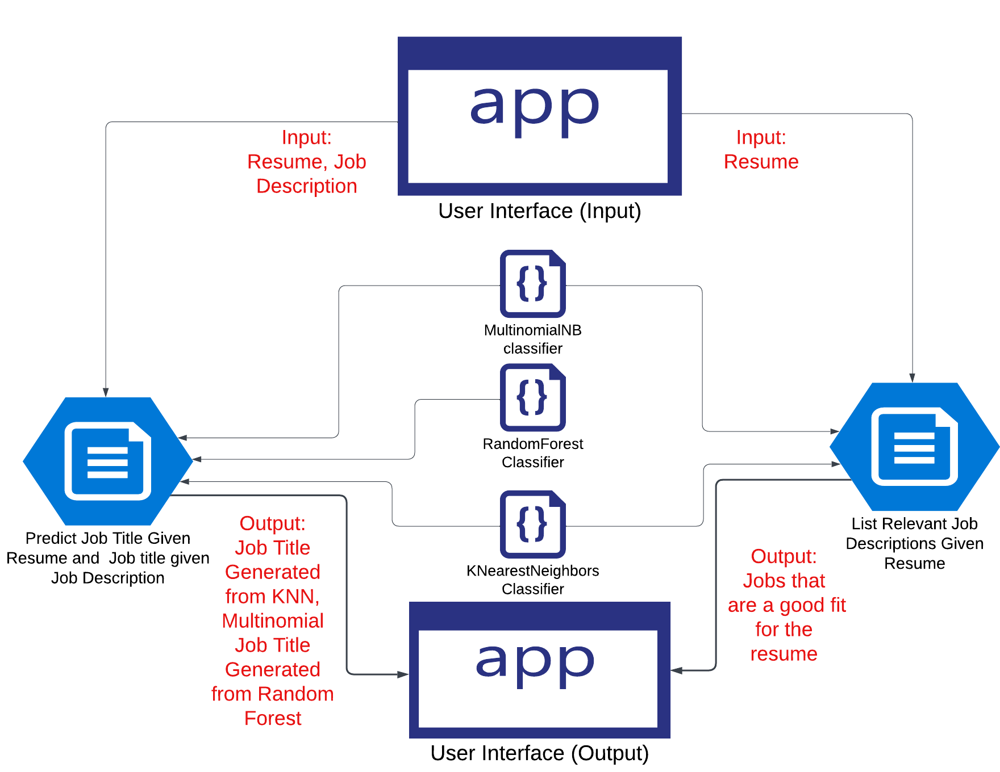

# Course Project  Overview
*This document serves as the documentation of our final project for CS 410: Text Information Systems at UIUC.*  

We wanted to use our final project to help students in their job search. Specifically, we created a system that given a student's resume will display the jobs whose job descriptions fit their resume the most, thus increasing the chance of them getting hired by that company. We found that there were a lot of systems in place built for companies to help them match student's resumes to a job description, however, we could not find any technology designed for the student.  We believe that students should have better insight into the way that their resumes are processed and matched with relevant job titles and job descriptions. 
  
We have designed an interactive Website that allows the user to:

**1.  Compare the job title that their resume most likely represents to
    the job title a selected job description most likely represents.**
    
**2.  Based on an inputted resume you can see jobs that have the best fit with the given resume and list them for the user to view.**

   
   
Please Feel free to watch the video demonstrating the purpose of our project, how to set it up, a couple of example cases, and some improvements we hope to make in the future.  

***Here is the Youtube Link htttp:asdjrkadsfkasjdkdmask***
  
# Implementation Documentation  
*To give an overview of our technologies we have broken it down into 3 main parts:*  
  
 ## Training - Machine Learning      
 *We have 2 main parts where we use Machine Learning Models:*     
 ### Predicting Job Title From Resume      
- We wanted to use two different classification models for the Resume Parsing as we found that utilizing only one proved to have skewed results based on the formatting and content of a resume. We also wanted to enable the user to have a better understanding of whether their resume could be mapped to different job descriptions given a company's unique Resume Parser.  In other words, the two models allowed the user to get a picture of whether the content in their resume would actually map to a certain job description or multiple job descriptions.
- **KNearestNeighbors Classifier**
	-  Using the dataset which can be found at: ```/app/data/UpdatedResumeDataSet.csv```. The dataset contains a relationship between Resumes and Job Titles. *The input of the data is expected to be a string (you will have to write your own code if you are not passing in a string).*
	-   The steps of the classifier are:
		 1. Clean the data. 
			 - Look for symbols, extra spaces, non-alphabetical characters. This is done by the *cleanResume* function located in *load_models.py*. The return string should be english alphabet words separated by one space each.

		```
		def cleanResume(resumeText):  
			resumeText = re.sub('RT|cc', ' ', resumeText)  # remove RT and cc  
			resumeText = re.sub('#S+', '', resumeText)  
		    resumeText = re.sub('[%s]' % re.escape("""!"#$%&'()*+,-./:;<=>?@[]^_`{|}~"""), ' ', resumeText)  # remove punctuations  
		    return resumeText
			    
		resumeDataSet['cleaned_resume'] = resumeDataSet.description.apply(lambda x: cleanResume(x))  
		resumeDataSet['cleaned_job_title'] = resumeDataSet.job.apply(lambda x: cleanResume(x))
		```

		2. 	Encode the labels of the Resume classes.
		
		```
		var_mod = ['cleaned_job_title']  
		le = LabelEncoder()  
		for i in var_mod:  
		    resumeDataSet[i] = le.fit_transform(resumeDataSet[i])  
		var_mod = None  
		requiredText = resumeDataSet['cleaned_resume'].values  
		requiredTarget = resumeDataSet['job'].values		
		```
			
		3.   Use TfIDF to vectorize the words of the resume
			 - Default Settings are sublinear_TF = true, stop_words = 'english', max_features = 1500.
		```
		word_vectorizer = TfidfVectorizer(sublinear_tf=True,  stop_words='english',  max_features=1500)  
		```
		4. Generate word features using the word_vectorizer built in step 3.
		```
		word_vectorizer.fit(requiredText)  
		WordFeatures = word_vectorizer.transform(requiredText)
		```
		5. Generate a train and test set with test_size equalling 0.2
		```
		X_train, X_test, y_train, y_test = train_test_split(WordFeatures,requiredTarget, random_state=0, test_size=0.2)
		```
		6. Specify the model as *KNeighborsClassifier()* and run a prediction on the set.
		```
		clf = OneVsRestClassifier(KNeighborsClassifier())  
		clf.fit(X_train, y_train)  
		prediction = clf.predict(X_test)  
		print(type(X_test))  
		print('Accuracy of KNeighbors Classifier on training set: {:.2f}'.format(clf.score(X_train, y_train)))  
		print('Accuracy of KNeighbors Classifier on test set: {:.2f}'.format(clf.score(X_test, y_test)))  
		print("n Classification report for classifier %s:n%sn" % (clf, metrics.classification_report(y_test, prediction)))  
		print(le.classes_)
		``` 
		7. Save model on your local computer to use later in the code.
		```
		filename = 'finalized_model_kneighbors.sav'  
		filename1 = 'tfidf_kneighbors.pkl'    
		pickle.dump(clf, open(filename, 'wb'))  
		pickle.dump(word_vectorizer, open(filename1, 'wb'))
		```
		8. Predict new data by passing a resume in string format to the model and generate prediction.
		```
		loaded_model = pickle.load(open('finalized_model_kneighbors.sav', 'rb'))
		loaded_tdif = pickle.load(open('tfidf.pkl', 'rb'))
		some_text2 = [ **resume_in_string_format**]
		unseen_df = pd.DataFrame({'text':some_text2}) 
		X_unseen = loaded_tdif.transform(unseen_df['text']).toarray()
		y_pred_unseen = loaded_model.predict(X_unseen)
		print(le.classes_[y_pred_unseen][0])
		```
	- Model Accuracy:
		- 	99% on Training Set
		- 97% on Test Set	  	
	
- **MultinomialNB Classifier**
	-   Using the dataset which can be found at: ```/app/data/UpdatedResumeDataSet.csv```. The dataset contains a relationship between Resumes and Job Titles. *The input of the data is expected to be a string (you will have to write your own code if you are not passing in a string).*
	-   The steps of the classifier are:
		 1. Clean the data. 
			 - Look for symbols, extra spaces, non-alphabetical characters. This is done by the *cleanResume* function located in *load_models.py*. The return string should be english alphabet words separated by one space each. 
		2. 	Encode the labels of the Resume classes.
		3.   Use TfIDF to vectorize the words of the resume
			 - Default Settings are sublinear_TF = true, stop_words = 'english', max_features = 1500.
		4. Generate word features using the word_vectorizer built in step 3.
		5. Generate a train and test set with test_size equalling 0.2
		6. Specify the model as *MultinomialNB()* and run a prediction on the set. 
		7. Save model on your local computer to use later in the code.
		8. Predict new data by passing a resume in string format to the model and generate prediction.
	- Model Accuracy:
		- 	99% on Training Set
		- 98% on Test Set	  	
   
 ### Predicting Job Title From Job Description
 -   We found that using a Random Forest Classifier was giving us the best results in classifying job titles based on specific job descriptions. Other classifiers were less accurately classifying data.
- **RandomForest Classifier**
	-   Using the dataset which can be found at: ```/app/data/JD_data.csv```. The dataset contains a relationship between Job Descriptions and Job Titles. *The input of the data is expected to be a string (you will have to write your own code if you are not passing in a string).*
	-   The steps of the classifier are:
		 1. Clean the data. 
			 - Look for symbols, extra spaces, non-alphabetical characters. This is done by the *cleanResume* function located in *load_models.py*. The return string should be english alphabet words separated by one space each. 
		2. 	Encode the labels of the Job Description classes.
		3.   Use TfIDF to vectorize the words of the resume
			 - Default Settings are sublinear_TF = true, stop_words = 'english', max_features = 1500.
		4. Generate word features using the word_vectorizer built in step 3.
		5. Generate a train and test set with test_size equalling 0.2
		6. Specify the model as *RandomForestClassifier(n=300)* and run a prediction on the set. 
		7. Save model on your local computer to use later in the code.
		8. Predict new data by passing a resume in string format to the model and generate prediction.
	- Model Accuracy:
		- 97% on Training Set
		- 63% on Test Set	  	


## Website - Webserver

  
  
  
  

 ## BackEnd - How the system actually works

**Please see the attached diagram to for an overview of different components:**

The user will run interact with the UI on our web-server. The user will be prompted with a home page containing two choices. The two choices are:

 1.  Compare the job title that their resume most likely represents to
        the job title a selected job description most likely represents.
        
	 - User Input Consists of:
		 - Their Resume and a job description that they want to compare too. 
		 - Format is two text boxes into which they can paste their corresponding resume and job description.
	 - The input then gets sent to the backend of our program to get processed by the machine learning models. 
		 - Multinomial and KNearestNeighbors processes the resume component.
		 - RandomForest processes the job description component.
	 - The corresponding predictions made by the classifiers get outputted for the user to compare.
	 - User Output consists of:
		 - Two job titles describing the inputted resume (Made by Multinomial and KNearestNeighbors classifiers).
		 - One job title describing the inputted job description.
        
  2. Based on an inputted resume you can see jobs that have the best fit with the given resume and list them for the user to view.
   	 - User Input Consists of:
		 - Their Resume
		 - Format is one text box into which they can paste their corresponding resume.
	 - The input then gets sent to the backend of our program to get processed by the machine learning model. 
		 -KNearestNeighbors processes the resume component.
	 - The corresponding prediction from the classifier gets sent to the processing function of our backend, which finds job titles that are the most associated with the predicted job title of the classifier. The relevant job descriptions are then outputted to the web-server.
	 - User Output consists of:
		 - List of job titles and their job descriptions corresponding to the predicted job title of the inputted resume.


  
  
  
# Code Documentation

##  Installation 
- Create a new directory to which you will clone the repo (we would recommend you call it CS410FinalProject. 
 - Programming languages used:
	 - Python 3.9
 - DataSets to be downloaded from Kaggle:
	 - Resume DataSet: https://www.kaggle.com/datasets/gauravduttakiit/resume-dataset
	 - Job Description DataSet:  https://www.kaggle.com/datasets/marcocavaco/scraped-job-descriptions


## Requirements
```
python >= 3.5
```

## Getting started
```bash
python3.9 -m venv .venv
source .venv/bin/activate
pip install -r requirements.txt
python -m spacy download en_core_web_lg
source .venv/bin/activate
export FLASK_APP=app
flask run
```


##  How to run the Program
 - Create a virtual environment inside the CS410FinalProject Repo.
	- Instructions are as follows:
		1. 
		
 - There should be a requirements.txt that the user should be able to run to get all packages. 
	 - run the command "........."
## Extra Thoughts/ Tips
	

 - 

## Next Steps
 - We are working on a limited dataset especially with the amount of job titles that can be classified by the resume models. At some point we would like to create our own data set that has more job titles and better variation of resumes. 
 - The classification models (especially for mapping the Job Descriptions to job titles) are not as accurate as we would like them to be. Figuring out a more nuanced way of filtering sections of a job description and resume is something we would want to look into.
 - Our models look at the whole text and treat it as one large document. We understand that resumes usually contain different sections such as the header which contains more direct information (information about major, gpa, school) versus more descriptive information of internships or previous projects.
 - We are definitely looking to make the UI better! It needs to do a better job of providing info in a concise and engaging manner. 


# Team Contributions
## Nikita 

 - Developed strategy and implementation of Machine Learning Models. 
 - Worked on documentation.
## James 
- Implemented web application